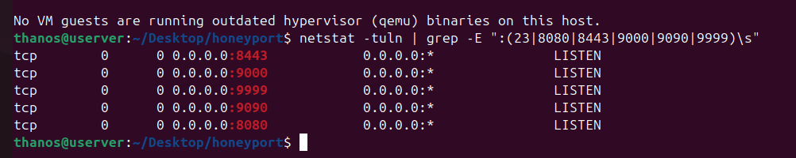
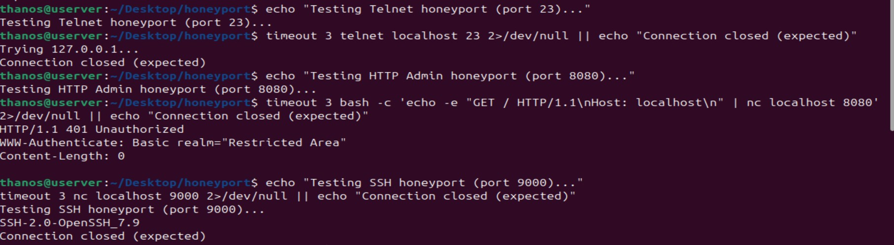
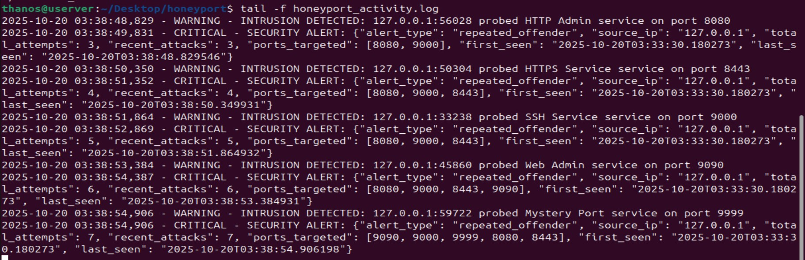
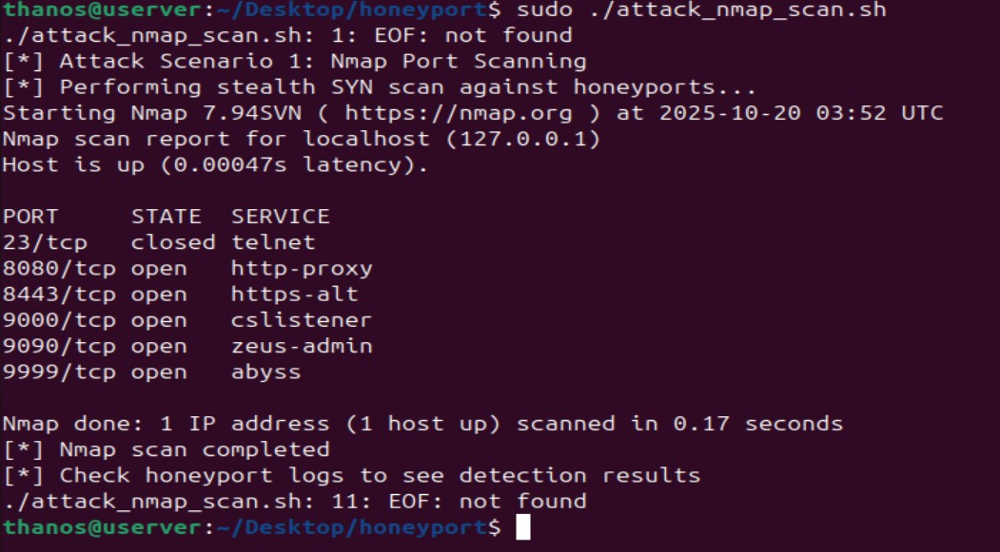
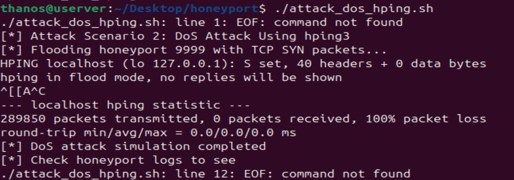
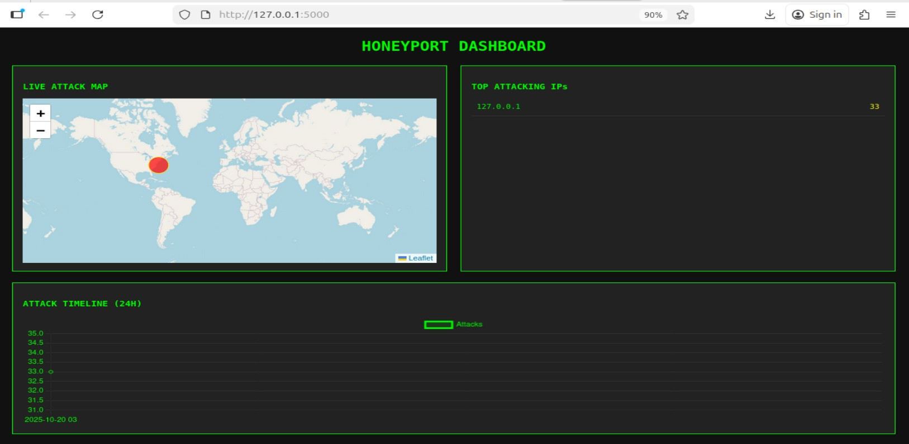
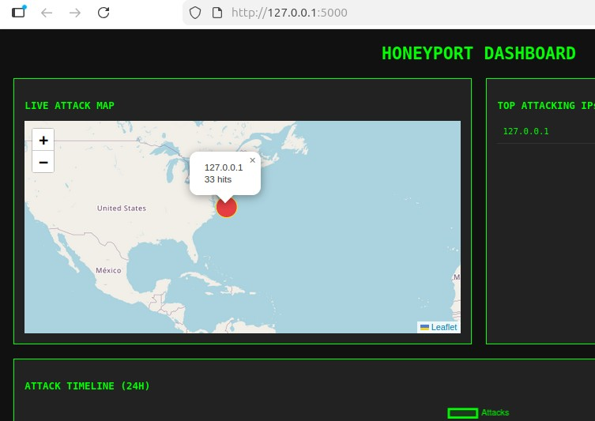

# honeyport-defense-lab-
Multi-port honeypot with automated IP blocking, a live attack dashboard, and Nmap/hping3 attack simulations — built for CNS3004 Enterprise Security. honeypot cybersecurity python flask network-security active-defense


# Advanced Honeyports — Active Defense Lab

**Course:** CNS3004 – Enterprise Security · School of Computing & Information Technology, University of Technology, Jamaica
**Author:** Mekhi Bentley

A hands-on active-defense lab: a multi-port honeypot ("honeyport") system that impersonates real
services, detects and logs anyone who touches it, escalates alerts for repeat offenders, auto-blocks
persistent attackers, and visualizes it all on a live web dashboard — then gets attacked with real
tools (Nmap, hping3) to prove it works.

## Why honeyports?

A honeypot is a decoy service with no legitimate traffic — anyone who connects to it is, by
definition, either scanning, misconfigured, or attacking. That makes detection extremely
low-noise compared to monitoring production services. This lab builds that idea up in stages:
a single fake port → a full multi-service decoy → automated response → attacker visualization.

## Architecture

| Port | Disguised as | Behavior |
|------|--------------|----------|
| 23   | Telnet | Closed/refused connection |
| 8080 | HTTP Admin panel | Responds `401 Unauthorized`, `WWW-Authenticate: Basic realm="Restricted Area"` |
| 8443 | HTTPS service | Listens, logs any connection |
| 9000 | SSH | Sends a real-looking banner: `SSH-2.0-OpenSSH_7.9` |
| 9090 | Web Admin | Listens, logs any connection |
| 9999 | "Mystery Port" | Listens, logs any connection — also the standalone smart-honeypot port |

Every connection attempt is written to `honeypot_activity.log` with a timestamp, source IP:port,
and which fake service was probed. A background tracker (`defaultdict`-based) counts attempts per
source IP; once the same IP shows up repeatedly across multiple ports in a short window, the system
escalates from a `WARNING` to a `CRITICAL` JSON security alert.

## Step 1 — Environment setup

```bash
sudo apt update && sudo apt upgrade
sudo apt install -y netcat-traditional iptables git python3-pip hping3 nmap
mkdir honeyport && cd honeyport
```

(`netcat` had no install candidate on this system, so `netcat-traditional` was used instead.)

## Step 2 — The multi-port honeyport (`honeyport.py`)

The core is a Python class, `AdvancedHoneyport`, that spins up a listener thread per port, each
configured with a fake service name and banner. It tracks offenders and attack patterns in memory
and logs everything through Python's `logging` module:

```python
#!/usr/bin/env python3
import socket
import threading
import datetime
import logging
import json
import time
from collections import defaultdict

logging.basicConfig(
    filename='honeyport_activity.log',
    level=logging.INFO,
    format='%(asctime)s - %(levelname)s - %(message)s'
)

class AdvancedHoneyport:
    def __init__(self):
        # Track offenders and their attack patterns
        self.offenders = defaultdict(int)
        self.attack_patterns = defaultdict(list)
        self.active_ports = {}

        # Define our honeyports and what they pretend to be
        self.port_config = {
            23: {
                "name": "Telnet",
                ...
            },
            # ...8080 (HTTP Admin), 8443 (HTTPS Service),
            # 9000 (SSH Service), 9090 (Web Admin), 9999 (Mystery Port)
        }
```

> The lab document only captures this file up to the `port_config` dict shown above. The rest of
> [`src/honeyport.py`](src/honeyport.py) (threading, per-port handlers, offender tracking, alert
> escalation) is a reconstruction that reproduces the exact log lines and JSON alert shape seen in
> [`logs/honeypot_activity.sample.log`](logs/honeypot_activity.sample.log) — see the file's docstring
> for details. Swap in your original from the lab VM if you still have it.

Run it in the background and confirm it's listening:

```bash
python3 honeyport.py > honeyport_output.log2>&1 & honeyport_PID=$!
echo $honeyport_PID > honeyport_pid
netstat -tuln | grep -E ":(23|8080|8443|9000|9090|9999)\s"
```



## Step 3 — Confirming the disguise

Manually connecting to each port shows it giving a believable response rather than an obvious
"honeypot" tell — the HTTP port returns a real 401 challenge, the SSH port returns a real
OpenSSH banner string:

```bash
timeout 3 telnet localhost 23
timeout 3 bash -c 'echo -e "GET / HTTP/1.1\nHost: localhost\n" | nc localhost 8080'
timeout 3 nc localhost 9000
```



## Step 4 — Attack detection and escalating alerts

Scanning across all six ports (`simulate_attack.sh`, see [`scripts/`](scripts)) immediately
produces `WARNING` entries per probe, and once the same source IP crosses several ports the
tracker escalates to a `CRITICAL` alert carrying structured JSON — attempt count, which ports
were hit, and first/last-seen timestamps:

```json
{
  "alert_type": "repeated_offender",
  "source_ip": "127.0.0.1",
  "total_attempts": 7,
  "recent_attacks": 7,
  "ports_targeted": [9090, 9000, 9999, 8080, 8443],
  "first_seen": "2025-10-20T03:33:30.180273",
  "last_seen": "2025-10-20T03:38:54.906198"
}
```



Full sample log: [`logs/honeypot_activity.sample.log`](logs/honeypot_activity.sample.log)

## Step 5 — Automated response (`smart_honeypot.py`)

A second, simpler honeypot listens on port 9999 and automatically blocks a source IP after 3
connection attempts (moving from passive logging to active response):

```
[+] Smart honeypot listening on port 9999
[+] Auto-blocking IPs after 3 attempts
```

Sample log: [`logs/smart_honeypot.sample.log`](logs/smart_honeypot.sample.log)

## Step 6 — Red-teaming the honeyports

Two real attack tools were run against the system to confirm detection holds up against actual
tradecraft, not just `nc`:

**Nmap stealth SYN scan** across the whole honeyport range — note how each port answers with a
plausible-but-fake service fingerprint (`cslistener`, `zeus-admin`, `abyss`):

```bash
nmap -sS -p 23,8080,8443,9000,9090,9999 localhost
```



**hping3 SYN flood** against port 9999 — a 10-second flood pushed through roughly 290,000 packets:

```bash
sudo timeout 10s hping3 -S -p 9999 -c 100 --flood localhost
```



Both scripts are in [`scripts/`](scripts) exactly as written for the lab.

## Step 7 — Live dashboard (`dash.py`)

A small Flask app parses `honeypot_activity.log`, geolocates attacker IPs, and serves a dark-themed
dashboard (Leaflet.js map + attacker table + 24h timeline) at `http://127.0.0.1:5000`:

```python
from flask import Flask, jsonify
import re
from collections import Counter, defaultdict

app = Flask(__name__)

def get_logs():
    data = []
    try:
        import os
        log_path = os.path.expanduser("~/Desktop/New Folder/honeyport/honeypot_activity.log")
        with open(log_path) as f:
            for line in f:
                # Try multiple log formats
                m = re.search(r'(\d{4}-\d{2}-\d{2}\s+\d{2}:\d{2}:\d{2}).*?(\d+\.\d+\.\d+\.\d+).*?port\s+(\d+)', line)
                if not m:
                    m = re.search(r'(\d{4}-\d{2}-\d{2}\s+\d{2}:\d{2}:\d{2}).*?(\d+\.\d+\.\d+\.\d+)', line)
                    if m:
                        data.append({'time': m[1], 'ip': m[2], 'port': 'unknown'})
                    else:
                        data.append({'time': m[1], 'ip': m[2], 'port': m[3]})
    except Exception as e:
        print(f"Error reading logs: {e}")
    return data

def get_coords(ip):
    ...
```

> Same caveat as `honeyport.py` — the doc only shows roughly the first half of this file, cut off
> partway through `get_logs()`. `get_coords()` isn't visible at all, and neither is the frontend.
> [`src/dash.py`](src/dash.py) and [`src/templates/index.html`](src/templates/index.html) reproduce
> the get_logs() regex verbatim and rebuild the rest (geolocation with a private-IP fallback, the
> `/api/data` route, and the Leaflet/Chart.js frontend) to match this screenshot. Swap in your
> original from the lab VM if you still have it.




## Compliance note

The lab closes with a question directly relevant to a GRC/compliance angle on active defense:

> **Q: If a hacker attacks one or more of the Honeyports, does this constitute a cybersecurity
> breach that must be reported to the Office of the Information Commissioner?**
>
> A: A honeyport attack is not automatically a reportable breach, because no personal data is
> involved. It only becomes reportable if the attacker progresses into systems containing personal
> data or creates a substantial risk to such data.

## Running it yourself

```bash
pip install flask
cd src
sudo python3 honeyport.py          # binds 23, 8080, 8443, 9000, 9090, 9999
python3 dash.py                    # dashboard at http://127.0.0.1:5000
../scripts/simulate_attack.sh      # from another terminal
```

`honeyport.py` and `dash.py` were re-verified end to end while assembling this repo: the escalation
logic reproduces the exact `total_attempts` / `ports_targeted` progression in
[`logs/honeypot_activity.sample.log`](logs/honeypot_activity.sample.log) line for line.

## Repo layout

```
.
├── README.md
├── scripts/
│   ├── simulate_attack.sh       # scan all 6 honeyports with nc
│   ├── attack_nmap_scan.sh      # Nmap stealth SYN scan
│   └── attack_dos_hping.sh      # hping3 SYN flood
├── src/
│   ├── honeyport.py             # multi-port honeypot (reconstructed past the visible excerpt)
│   ├── smart_honeypot.py        # auto-blocking honeypot (reconstructed)
│   ├── dash.py                  # Flask dashboard (reconstructed past the visible excerpt)
│   └── templates/index.html     # dashboard frontend (reconstructed)
├── logs/
│   ├── honeypot_activity.sample.log
│   └── smart_honeypot.sample.log
└── assets/                      # lab screenshots referenced above
```

## Disclaimer

Built and run entirely against `localhost` in an isolated lab VM for coursework. Don't point
honeypots, port scans, or flood tools at hosts or networks you don't own or don't have explicit
authorization to test.
